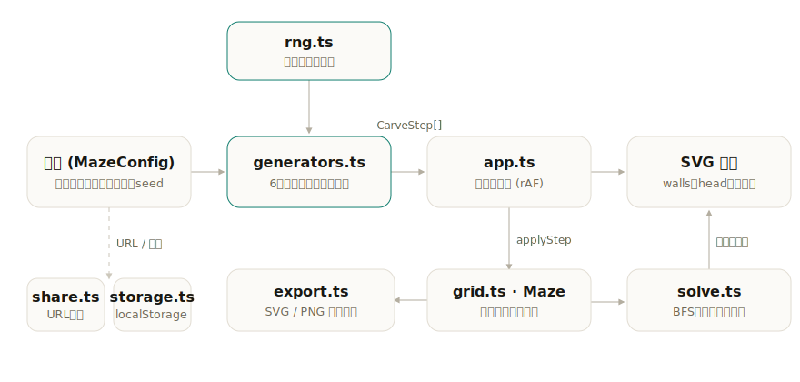

# meiro

[](https://github.com/miruky/meiro/actions/workflows/ci.yml)
[](https://github.com/miruky/meiro/actions/workflows/deploy.yml)
[](https://www.typescriptlang.org/)
[](LICENSE)

**6種類の迷路生成アルゴリズムを、壁を掘っていく過程のアニメーションで並べて見比べるビジュアライザ。**

デモ: [miruky.github.io/meiro](https://miruky.github.io/meiro/)

## 概要

同じ「穴のない完全な迷路」でも、作り方によって迷路の性格は大きく変わる。一本道が長く伸びるもの、短い行き止まりが密集するもの、横方向にだけ癖が出るもの。meiro はアルゴリズムを選ぶと、壁を1枚ずつ取り除いて通路を掘っていく様子をそのまま再生し、出来上がった迷路の行き止まり率や最短手数といった指標を並べて表示する。再生は一時停止・ステップ送り・最初からやり直しができ、解答の最短経路を重ねて描ける。

扱うアルゴリズムは、再帰的バックトラッカー、ランダム化Prim法、ランダム化Kruskal法、Wilson法、Hunt-and-Kill、Sidewinder の6つ。いずれも結果は全域木、すなわち全セルがちょうど一通りの道でつながった完全迷路になる。生成はシード付き乱数だけに依存するので、同じ設定からは必ず同じ迷路が再現され、その設定はURLに載せて共有できる。

### なぜ作ったのか

迷路生成アルゴリズムの解説は、擬似コードと完成図だけで終わっていることが多い。完成図を見比べても「Prim法は行き止まりが多い」「バックトラッカーは一本道が長い」といった違いは伝わりにくく、その違いがどの手順から生まれるのかはなおさら見えない。掘り進む順序こそが各アルゴリズムの個性そのものなので、過程を同じ盤面・同じ速度・同じ指標で再生して並べれば、言葉での説明より早く腑に落ちる。そう考えて、生成の手順列をそのまま描画に使える構造で組み直した。

## アーキテクチャ

生成器は迷路そのものではなく「壁を取り除く手」の列(`CarveStep[]`)を返す。再生ループはこの列を一手ずつ壁モデルへ適用するだけなので、生成ロジックと描画・アニメーションが分離され、どのアルゴリズムも同じ再生機構に載る。



## 技術スタック

| カテゴリ     | 技術                                     |
| :----------- | :--------------------------------------- |
| 言語         | TypeScript 5(strict)                     |
| 描画         | SVG を直接組み立て(フレームワーク非依存) |
| ビルド       | Vite 8                                   |
| テスト       | Vitest 4                                 |
| リンタ・整形 | ESLint 9 / Prettier 3                    |
| CI・配信     | GitHub Actions / GitHub Pages            |

## 使い方

### 画面の操作

アルゴリズム・幅・高さ・速さを選ぶと迷路の生成が始まる。幅と高さは別々に動かせるので、正方形だけでなく横長・縦長の盤面も作れる。生成ボタンで再生と一時停止を切り替え、ステップ送りで一手ずつ確認でき、「別の迷路」は同じアルゴリズムのままシードだけ変える。「解答」を押すと、左上の入口から右下の出口への最短経路を重ねて描く。生成し終えると、行き止まり率を細いバーで併せて示す。

「リンクをコピー」で今の設定を載せたURLが得られ、「SVG」「PNG」で表示中の迷路を画像として書き出せる(解答を表示していれば経路も一緒に焼き込まれる)。

### キーボード操作

| キー    | 動作                   |
| :------ | :--------------------- |
| `Space` | 生成の再生・一時停止   |
| `→`     | 一手だけ進める         |
| `R`     | 最初からやり直す       |
| `N`     | シードを変えて別の迷路 |
| `S`     | 解答の表示切り替え     |

入力欄やセレクトにフォーカスがあるときは、入力を妨げないようショートカットを無効にする。`prefers-reduced-motion` が有効な環境では生成アニメーションを省き、結果の迷路を即座に表示する。

### 共有URLの形式

設定はハッシュに `バージョン|アルゴリズム|幅|高さ|シード` の順で畳まれる。幅と高さはそれぞれ独立に持つ。たとえば次のURLは、40×12・シード7 の Sidewinder を開く。

```
https://miruky.github.io/meiro/#c=1|sidewinder|40|12|7
```

アルゴリズムの識別子は `backtracker` `prim` `kruskal` `wilson` `huntkill` `sidewinder`。範囲外の値や未知の識別子は読み捨てられ、既定値で開く。

### ライブラリとして使う

生成・探索・分析のロジックは描画から独立していて、そのまま呼び出せる。

```ts
import { getGenerator } from './src/lib/generators';
import { makePRNG } from './src/lib/rng';
import { buildMaze } from './src/lib/grid';
import { solve, analyze } from './src/lib/solve';

const gen = getGenerator('prim')!;
const steps = gen.run(20, 20, makePRNG(12345)); // 壁を取り除く手の列(長さ = セル数 - 1)
const maze = buildMaze(20, 20, steps); // 手の列を適用した完成迷路

solve(maze);
// → { path: [{x:0,y:0}, …, {x:19,y:19}], visitedOrder: [...] }

analyze(maze);
// → { cells: 400, passages: 399, deadEnds: 116, deadEndRatio: 0.29, solutionLength: 79 }
```

`run` に渡す乱数が同じなら手の列も常に同じになるため、結果は完全に再現できる。`solve` は入口から出口への最短経路(BFS)を、`analyze` は行き止まりの数や割合、最短手数といった指標を返す。

## プロジェクト構成

- `src/lib/` — 描画から独立した中核ロジック
  - `grid.ts` — 壁ビットを持つ迷路モデル `Maze` と、手の列から迷路を組む `buildMaze`
  - `generators.ts` — 6つの生成アルゴリズム。いずれも `CarveStep[]` を返す
  - `rng.ts` — シード付き擬似乱数(mulberry32)とシャッフル等のヘルパ
  - `solve.ts` — BFS による最短経路探索と、迷路の指標を出す `analyze`
  - `export.ts` — 迷路を単体表示できるSVG文字列に書き出す `mazeToSvg`
  - `share.ts` — 設定とURL文字列の相互変換
  - `storage.ts` — 設定の localStorage 保存
- `src/app.ts` — SVG盤面の構築、再生ループ、コントロールの組み立て
- `src/icons.ts` — currentColor で描く線画アイコン
- `src/style.css` — 配色・レイアウト・モーション
- `docs/architecture.svg` — 上図の元データ
- `public/` — favicon とロゴ

## はじめ方

### 前提条件

Node.js 20 以上(CI は 24 で検証)。

### セットアップ

```bash
git clone https://github.com/miruky/meiro.git
cd meiro
npm ci
npm run dev
```

### テストの実行

```bash
npm test
```

生成器が常に全域木(連結かつ閉路なし)を作ること、同一シードでの再現性、探索結果が実際に通路でつながった経路であることなどを検証する。

### Lint と整形

```bash
npm run lint
npm run fmt
```

### ビルドとデプロイ

```bash
npm run build
```

GitHub Pages はリポジトリ名のサブパスで配信されるため、配信ビルドだけ `MEIRO_BASE` で base を切り替える。`main` への push で `deploy.yml` が `MEIRO_BASE=/meiro/` を渡してビルドし、Pages へ公開する。

```bash
MEIRO_BASE=/meiro/ npm run build
```

## 設計方針

- **手順列と描画の分離** — 生成器は迷路ではなく「壁を取り除く手」の列を返す。完成形だけでなく途中経過がそのままデータになり、再生・ステップ送り・やり直しが同じ列の読み進めで実現できる。アルゴリズムを足すときも、描画側には手を入れない。

- **シード駆動の再現性** — 乱数源を一つのシード付き擬似乱数に限定し、生成器は他の乱数に触れない。同じシードからは必ず同じ迷路ができるので、URLで共有した迷路は相手の画面でも完全に一致する。

- **壁はビットで持つ** — 各セルが上下左右4ビットの壁状態を持ち、隣り合う2セルの壁を同時に消すことで通路を掘る。生成も探索も指標計算もこの一つのモデルを共有し、状態の二重持ちをなくしている。

- **モーションは意味の補助に限る** — 入場の立ち上がり、解答線の描き起こし、再生ヘッドの移動など、変化を読み取りやすくするための動きだけを付ける。`prefers-reduced-motion: reduce` ではいずれも無効化し、生成アニメーションも省いて結果を即座に出す。

- **壁の幾何は一箇所で持つ** — 画面の盤面も画像の書き出しも、壁を1本のパスにまとめる同じ関数(`wallPathD`)を使う。表示と書き出しで線が食い違わず、書き出した画像はブラウザ上の見た目をそのまま写し取る。

## 制約

- 生成するのは全域木の完全迷路で、ループや部屋のある迷路、複数解を持つ迷路は対象外。
- 幅・高さは各 5〜60 マスの範囲で指定する。これを超える規模では生成・探索の所要時間が体感できるほど伸びる。
- 入口は常に左上、出口は常に右下に固定。
- ライト・ダークは OS の設定に追従する。画面内に切り替えスイッチは持たない。書き出す画像の配色も、書き出し時のOS設定に合わせる。

## ライセンス

[MIT](LICENSE)
